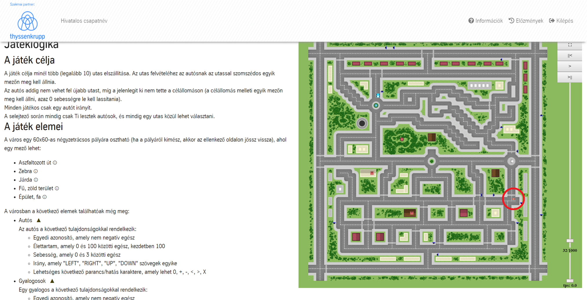

# Coding Tomorrow Cup

This was our project to the Coding Tomorrow Cup competition.

## Concept

We had to develope a self-driven car which can transport a passanger from A to B. We got the map information from a server through JSON and we had to process it. The car was controlled by the server according to the answer of our program, for example we could send accelerate, decelerate, turn and so on. One of us was in charge of the routing, another of the communication with the server and I had to take care about the "self-driving" logic.

After the first qualifier we did a lot of refactoring so the code in this state do not represnt fully the program which we used to advance. The program was never finished.

## Screenshots

## Team members

Gajdár Krisztián
Sebő Andor
Répás Kristóf  
Lázár Dávid

## Links

Coding Tomorrow Cup - https://www.codingcup.hu/
Original repository - https://github.com/ame307/Coding-Tomorrow-Cup